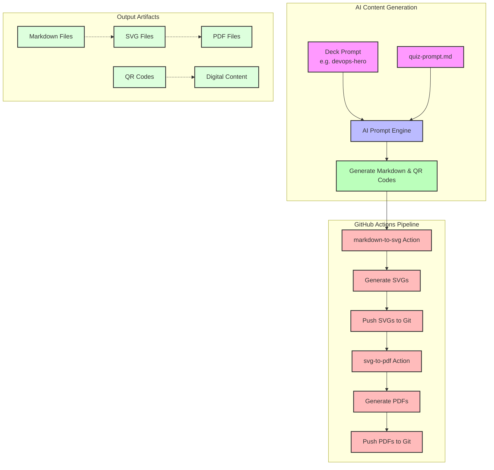

# Project Documentation 📚

## Project Overview 🎯

This project is an AI-powered quiz generation system that creates high-quality, visually appealing quiz cards for various learning and assessment purposes. The system combines the power of AI language models (Claude and ChatGPT) with automated image generation to create engaging educational content.

### Use Cases 🎓
- **Professional Certification Preparation**: Create study materials for technical certifications (DevOps, Cloud, Security, etc.)
- **Educational Gaming**: Generate interactive quiz cards for classroom activities or educational games
- **Corporate Training**: Develop assessment materials for employee training programs
- **Personal Learning**: Create custom study decks for self-paced learning
- **Social Learning**: Generate quiz cards for group study sessions or family game nights

### Technical Approach 🛠️

The system follows a modular approach:

1. **Content Generation**
   - Uses AI prompts to generate questions, answers, and explanations
   - Supports multiple question types (code blocks, knowledge-based, etc.)
   - Maintains consistency through structured prompt engineering

2. **Visual Generation**
   - Converts text content into visually appealing SVG cards
   - Uses QR codes for easy access to digital content
   - Implements consistent styling and formatting

3. **Automation Pipeline**
   - Automated question generation and iteration
   - Batch processing of quiz decks
   - Version control for content management

4. **Output Formats**
   - Markdown files for content storage
   - SVG files for visual representation
   - Printable format for physical cards

### Key Components 🔑

- **Prompt Engineering**: Structured prompts in `quiz-prompt.md` guide AI generation
- **Content Management**: Organized storage of questions and assets
- **Visual Design**: Automated SVG generation with consistent styling
- **Printing System**: Optimized for high-quality physical output

## Prerequisites 🛠️

```sh
brew install qrencode
brew install librsvg
```

## Usage Guide 🚀

### Using Claude Code or ChatGPT

To generate new questions:
```
Build a list of questions (and related assets), given the quiz-prompt.md prompt file that contains all requirements and specifications to build a quiz deck of type "fun-math";  limit the number of generated questions 5.
```

To reiterate on existing questions:
```sh
Follow instructions in quiz-prompt.md, to build a quiz deck of type devops-hero; only generate 2 questions, one of type code-block, one of type Knowledge-Based; you can reuse the .md files that were previously generated, but svg files must be recreated from scratch, only using the content of the prompt as context.
```

## Hardware Requirements 🖨️

### Recommended Printer Setup
- [Canon Pixma G650 Megatank](https://www.amazon.es/Canon-4620C006-PIXMA-G650/dp/B093QG1Y8C) - Impresora Fotográfica 3 en 1 (233€)
- [Papel Fotográfico Láser Brillante](https://www.amazon.es/Fotogr%C3%A1fico-Brillante-impresoras-Certificados-Calendarios/dp/B07VVDM9FJ) - Doble cara, A4, 250 g/m², 100 hojas
- [Laser Printer Discussion](https://www.reddit.com/r/Printing/comments/10un1q5/a_decent_laser_printer_for_heavyweight_paper/?tl=es-es) - Reddit thread about suitable printers
- [Laser Cutting Machine](https://www.amazon.es/Atomstack-P1-5W-Escritorio-Biblioteca/dp/B0DX68H75L)

## Future Development Ideas 💡

### Planned Improvements
1. **Split quiz-prompt.md into sequential steps:**
   - Read and understand content requirements (from deck md file)
   - Generate questions, options, and answers in .md format under `questions/<deck id>`
   - Iterate on questions, parse contents from .md files and generate SVG files
   - Implement deterministic SVG generation using software instead of AI prompts

2. **Website Enhancements:**
   - Create a cleaner URI structure
   - Use a professional domain name (quiz.session.it or purchased domain)
   - Improve markdown file visualization
   - Enhance SVG visualization with better colors and fonts

## System Architecture Diagram 📊



The diagram above illustrates the complete workflow of the quiz generation system:

1. **AI Content Generation**
   - The system starts with a deck-specific prompt (e.g., devops-hero) and the main quiz-prompt.md
   - The AI Prompt Engine processes these inputs to generate markdown content and QR codes
   - This creates the foundation for all subsequent steps

2. **GitHub Actions Pipeline**
   - The markdown-to-svg action converts the generated markdown into SVG files
   - SVGs are automatically pushed to the Git repository
   - The svg-to-pdf action then converts SVGs to PDF format
   - PDFs are also automatically pushed to the repository

3. **Output Artifacts**
   - The system produces multiple formats:
     - Markdown files for content storage
     - SVG files for web display
     - PDF files for printing
     - QR codes linking to digital content

This automated pipeline ensures consistent, high-quality output across all formats while maintaining version control of all generated content.

## Technical Features

- **YAML to Markdown Converter**: Convert YAML content to structured markdown format
- **YAML to SVG Converter**: Convert YAML content to SVG format with proper styling
- **QR Code Generator**: Generate QR codes for linking to digital content
- **SVG Generator**: Create SVG images for quiz questions with QR codes and answers
- **SVG to PDF Converter**: Convert SVG files to PDF with proper image handling and scaling

## Technical Installation

The project uses Poetry for dependency management. To install:

```bash
# Install Poetry if you haven't already
curl -sSL https://install.python-poetry.org | python3 -

# Clone the repository
git clone https://github.com/yourusername/quiz-tools.git
cd quiz-tools

# Install dependencies
poetry install
```

## Technical Usage

### YAML to Markdown Converter

```python
from yaml_to_markdown import YAMLToMarkdownConverter

# Create a converter instance
converter = YAMLToMarkdownConverter()

# Convert YAML to Markdown
converter.convert_yaml_to_markdown("input.yaml", "output.md")
```

### YAML to SVG Converter

```python
from yaml_to_svg import YAMLToSVGConverter

# Create a converter instance
converter = YAMLToSVGConverter()

# Convert YAML to SVG
converter.convert_yaml_to_svg("input.yaml", "output.svg")
```

### QR Code Generator

```python
from qr_generator import QRGenerator

# Create a QR generator instance
generator = QRGenerator()

# Generate a QR code
generator.generate_qr("https://example.com", "qr_code.png")
```

### SVG to PDF Converter

```python
from svg_to_pdf import SVGToPDFConverter

# Create a converter instance
converter = SVGToPDFConverter()

# Convert an SVG to PDF
converter.convert_svg_to_pdf("input.svg", "output.pdf")
```

## Technical Command Line Interface

### YAML to Markdown Converter

```bash
poetry run python -m yaml_to_markdown.converter input.yaml -o output.md
```

### YAML to SVG Converter

```bash
poetry run python -m yaml_to_svg.converter input.yaml -o output.svg
```

### QR Code Generator

```bash
poetry run python -m qr_generator.generator "https://example.com" -o qr_code.png
```

### SVG to PDF Converter

```bash
poetry run python -m svg_to_pdf.converter input.svg -o output.pdf
```

## Technical Development

### Running Tests

```bash
poetry run pytest
```

### Type Checking

```bash
poetry run mypy src
```

### Linting

```bash
poetry run black src tests
poetry run isort src tests
poetry run flake8 src tests
```

### Building the Project

```bash
poetry build
```

### Installing in Development Mode

```bash
poetry install
```

## Technical License

MIT License

## Technical Contributing

1. Fork the repository
2. Create a feature branch
3. Commit your changes
4. Push to the branch
5. Create a Pull Request