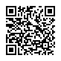

# Look at the image and identify which statements are true

Scan the QR code to see an image with various geometric shapes.

1. There are > 5 circles
2. Blue triangle exists
3. More red than blue
4. Yellow square shown
5. Shapes overlap
6. Green shape present
7. All shapes same size
8. Purple pentagon shown
9. Orange circle exists
10. Contains 3D shapes

*Question type: QR (Image) | Answer type: Binary (True/False) | Source: Shape identification | [View online](https://blog.session.it/quiz/decks/fun-math/questions/004/question)*