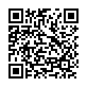

# What is the name of each shape in the image?

Scan the QR code to see an image with 10 different shapes.

1. Shape 1
2. Shape 2
3. Shape 3
4. Shape 4
5. Shape 5
6. Shape 6
7. Shape 7
8. Shape 8
9. Shape 9
10. Shape 10

*Question type: QR (Image) | Answer type: Names | Source: Geometry identification | [View online](https://blog.session.it/quiz/decks/fun-math/questions/006/question)*